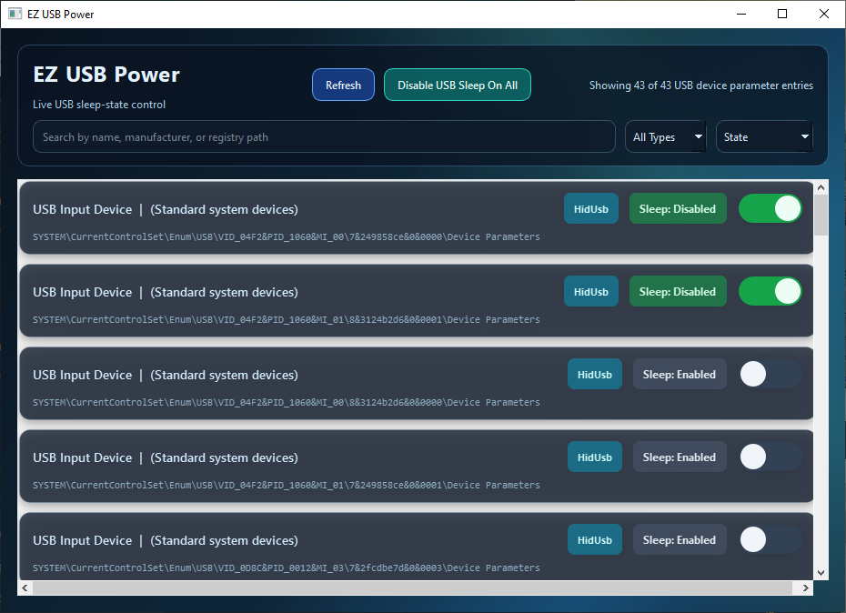

# EZ USB Power (PyQt)

Desktop GUI for scanning USB devices and controlling USB sleep power behavior via Windows registry.



## Features

- Enumerates USB device `Device Parameters` keys under:
  - `HKLM\SYSTEM\CurrentControlSet\Enum\USB`
- Displays each device with:
  - Friendly display name (prefers `FriendlyName`, then `BusReportedDeviceDesc`, then `DeviceDesc`)
  - Manufacturer
  - Device type (`Class`, fallback to `Service`)
  - Registry path
  - Current sleep state from `EnhancedPowerManagementEnabled`
- Search, sort, and filter controls:
  - Search by name, manufacturer, type, or registry path
  - Filter by device type
  - Sort by name, state, type, or manufacturer
- Per-device animated toggle switch:
  - ON = USB sleep disabled (`EnhancedPowerManagementEnabled=0`)
  - OFF = USB sleep enabled (`EnhancedPowerManagementEnabled=1`)
- Global action button:
  - `Disable USB Sleep On All`
- On-demand elevation:
  - If running as a regular user, write actions prompt for UAC and run elevated PowerShell helper actions
  - Elevated helpers report success/failure back to the app so toggles do not silently revert
- Live refresh every 3 seconds
- Modern PyQt UI with flowing animated background

## Requirements

- Windows
- Python 3.10+
- Administrator approval (UAC) for changing registry values

Install dependencies:

```powershell
pip install -r requirements.txt
```

## Run

```powershell
python .\usb_power_gui.py
```

You can run as a regular user. When a write action needs elevation, the app prompts for Administrator approval (UAC).

## Build Release (Windows)

Use the build script:

```powershell
.\build_windows_release.ps1 -Version 0.1.0
```

Build outputs:

- EXE: `dist\EZ_USB_Power.exe`
- ZIP: `release\EZ_USB_Power_v<version>_win64.zip`

## Notes

- The app can read many registry keys without elevation, but write operations to `HKLM` usually require elevation.
- Some device keys may still reject writes even when elevated due to stricter ACLs set by Windows or drivers.
- If a device does not expose `EnhancedPowerManagementEnabled`, it is shown as `Sleep: Unavailable` and the toggle is disabled.

## Source Context

This GUI mirrors and extends behavior from:

- `usb_disable_sleep_confirm/usb_disable_sleep_confirm_0.1.ps1`
- `usb_disable_sleep_confirm/usb_disable_sleep_confirm_0.2.ps1`
